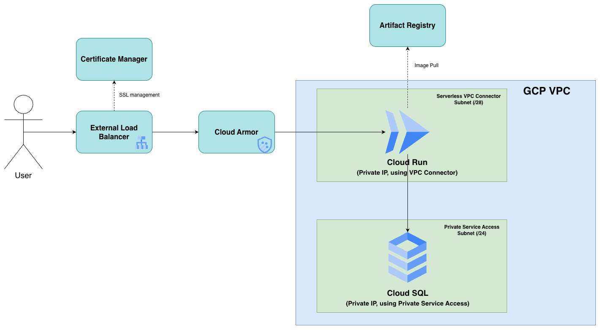
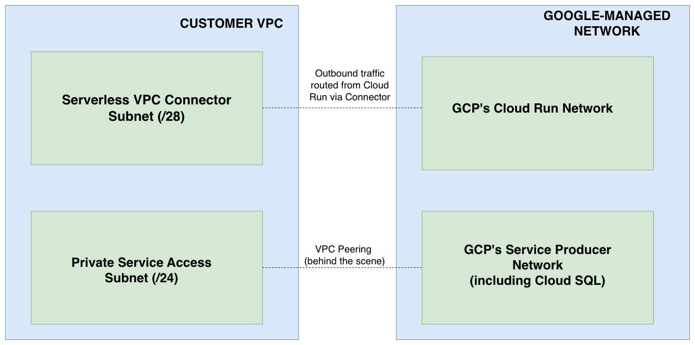

# Architecture Design Consideration & Tech Stack




## 1. Compute Layer

**Choice: Cloud Run**\
No infrastructure provisioned (aside from the VPC Serverless Connector),
dynamic autoscaling based on traffic, most affordable.

### Other options:

-   **Autopilot GKE.** This choice can be more affordable because
    billing depends on pod count and resource requests; however, it
    requires gateway/ingress provisioning, some YAML maintenance
    (deployment, service, config maps, autoscaling, etc.), and arguably
    has a high monthly cluster maintenance fee.
-   **Standard GKE.** In this case, there is no real benefit in
    provisioning dedicated VMs as nodes for the workload.
-   **Compute Engine (instance group with autoscaling).** While
    feasible, it is too complicated and oversized for simple APIs. VMs
    have higher startup time and require more complex
    maintenance/operations, including hardening, patching, instance
    templates, and rollouts. VMs are more suitable for larger/monolithic
    workloads.

## 2. Database Layer

**Choice: Cloud SQL (PostgreSQL)**\
Simplest maintenance - backup, replication, patching, and monitoring are
all managed. Great connectivity for both public and private instances,
including via Private Service Access (PSA) and Private Service Connect
(PSC). Good integration with code via Google Cloud SDK.

### Other options:

-   **Self-managed database (VMs).** Can be more affordable if done
    right, but requires higher maintenance effort.
-   **Firestore.** A good choice for NoSQL managed database needs. But
    since the use case mentions tables and rows (more commonly used as
    traditional SQL terms), an SQL database may be preferred in this
    case.
-   **Bigtable, Spanner, AlloyDB.** Too large/overkill for simple APIs.

## 3. Network Layer

Requires one VPC and two private IP ranges.

### Notes:

-   One IP range (typically smaller, like `/28`) is for the VPC
    Serverless Connector, so that Cloud Run can connect to the VPC.
-   The second range is for the Private Service Access range, which
    behind the scenes is a form of network peering between our VPC and
    GCP VPC as the service provider. This typically requires a `/16`
    range, but here I used `/24` for a more reasonable reservation. Upon
    provisioning, Cloud SQL will be given one IP from the range. The
    rest of the IPs can be used for other Cloud SQL instances and
    services supporting PSA.
-   As both Cloud Run and Cloud SQL are granted private IP, Cloud Run
    can connect to Cloud SQL without publicly exposing SQL - a best
    practice for databases.

## 4. Image Layer

Images are stored in Artifact Registry in the same region as the
infrastructure. This reduces cross-region image pull traffic fees from
Cloud Run.

## 5. Load Balancing & WAF Layer

Requires one External Layer 7 (HTTP/HTTPS) Load Balancer with SSL
certificates saved in GCP's Certificate Manager. Certificate Manager is
used so that certificates are not stored or supplied from Git (including
Terraform/GitLab CI files), and instead are stored in a dedicated and
secure place.

LB is routed to Cloud Run via Serverless NEG (Network Endpoint Group), as 
Cloud Run belongs to Google's serverless endpoints.

Cloud Armor is used for extra security, including: - Stopping SQL
Injection (implemented using pre-configured WAF rules) - Implementing IP
rate-limiting

## 6. Application Layer (code-wise)

The application connects to GCP using the Cloud SQL Connector library,
which handles: - IAM Authentication - no service account token embedded
in code - Traffic Encryption - no manual SSL config needed on SQL or on
the app - Connection without specifying IP/DNS, only specifying instance
name

The code uses Cloud Run's service account to authenticate to the
database.

## Database Replication

Considering the application is read-heavy and no write-heavy operations
were mentioned, provisioning Cloud SQL as a regional database (primary +
standby located in different zones) is already sufficient, if proper CPU
and memory are configured.

However, read replicas may be beneficial in some cases, including
potentially increasing the number of services/apps connecting to the
same database, or future write-heavy operations.

In this implementation: - Prod will have one read replica enabled (by
default placed in a different zone from the primary instance), and Cloud
Run will connect to that replica. - In the dev environment, the
application directly connects to the main database, and read replicas
can be disabled for cost saving.

## Network Subnet Design



## Security Groups (or related security notes)

Since GCP does not exactly have security groups, several additional
security measures should be noted:

-   Default firewall rules are enough, and no additional firewall rules
    are added via Terraform.
-   Cloud SQL does not recognize ingress firewall rules like VMs and
    typically requires ingress limitation only when clients connect via
    public IP (e.g., limiting via authorized networks or using Cloud SQL
    Auth Proxy).
-   On the Load Balancer, Cloud Armor is configured with rate limiting
    and anti-SQL injection rules.
-   SSL is enabled and saved in Certificate Manager, reducing
    certificate leakage from source control.
-   Cloud Run is configured to receive only internal traffic and traffic
    from the external load balancer using
    `INGRESS_TRAFFIC_INTERNAL_LOAD_BALANCER`. Hence, access bypassing
    the load balancer and Cloud Armor is not possible.
-   On Cloud SQL, aside from disabling public IP, extra security is
    implemented by using IAM users instead of traditional
    username/password authentication. The IAM user is only granted
    `SELECT` permission to the specific table to prevent unintended
    modification.

``` sql
GRANT SELECT ON "myapp" TO myapp-dev-sa@project-prod.iam
```

## Terraform Structure

In my private repository, there are three branches: Dev, Staging, and
Main - each representing Development, Staging, and Production
environments.

Each branch contains:

1.  **Env folder** with dev/staging/prod subfolders containing main.tf,
    variables.tf, outputs.tf, and corresponding tfvars.
2.  **Modules folder** containing reusable modules: network,
    loadbalancing, cloudsql, cloudrun, and security.
3.  **Src folder** containing source code and Dockerfile.

The Terraform script uses a GCS remote backend located in a central
project. Each environment uses different buckets to ensure separation.
The remote backend allows state locking and versioning.

## Pipeline Flow

The GitLab CI file includes the following stages:

1.  Validate (terraform init, terraform validate, terraform fmt)
2.  Deploy (terraform plan, terraform apply)
3.  Build (build Dockerfile & push to Artifact Registry)
4.  Deploy App (deploy to Cloud Run using gcloud run deploy)

### Challenge

Because the Load Balancer and Cloud Armor need Cloud Run to exist, Cloud
Run must deploy successfully during terraform apply. However, the build
stage happens after terraform apply, so the first deployment would fail
because the image does not exist yet.

### Solution

Segregate the infra (terraform apply) and app (docker build + gcloud run
deploy) aspects. The first terraform apply deploys a placeholder image.
Later, the correct image replaces it during deployment.

A lifecycle rule in Terraform ignores changes to the Cloud Run template
(image and environment variables) to prevent overwriting.

## Design Trade-off

Since Cloud SQL is private, the GitLab runner cannot directly connect
unless it runs in the same VPC.

Therefore, the initial database setup (create table, grant access) must
be done manually via Cloud SQL Studio, with instructions documented in
INIT_STEPS.md.

An alternative would be running the database script via a temporary
bastion host, which is feasible but adds complexity.

